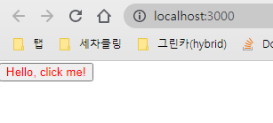

# 1. 워크스페이스 시작하기
```bash
$ npm install --global lerna
$ git init lerna-repo && cd lerna-repo
$ lerna init
```

# 2. yarn + workspaces 설정하기

## root/lerna.json
```json
{
  (...)
  "npmClient": "yarn",
  "useWorkspaces": true
}
```
## root/package.json
```json
{
  (...)
  "workspaces": ["packages/*"]
}
```

# 3. packages에 workspaces 생성하기
```bash
$ cd packages
$ yarn create react-app web --template typescript
$ yarn create react-app common --template typescript
```

# 4. 생성된 각 workspaces의 package.json > name 변경하기
```json
# web
"name": "@leehankue/web"
(...)

# common
"name": "@leehankue/common",
"main": "./src/index.tsx",
(...)

# root
"name": "@leehankue/root"
(...)
```

# 5. 공통 components 작업하기
## root/packages/common/src/components/Button.tsx
```typescript
import React from 'react'

type Props = {
    textColor: string;
    children: React.ReactNode;
}

const Button: React.FC<Props> = (props) => {
  return <button style={{"color": props.textColor}}>{props.children}</button>
}

export default Button;
```
## root/packages/common/src/index.tsx
```typescript
import Button from './components/Button';
export { Button };
```
index.tsx를 main으로 설정하기
```json
# common
"name": "@leehankue/common",
"main": "./src/index.tsx",
(...)
```

# 6. web package에서 common Button import해서 사용하기
## root/packages/web/src/App.tsx
```typescript
import React from 'react';
import { Button } from '@leehankue/common';

function App() {
  return (
    <Button textColor="red">Hello, click me!</Button>
  );
}

export default App;
```

# 7. web package가 될 종속성으로 common package 설정하기
## root
```bash
lerna add @leehankue/common --scope=@leehankue/web
```
### 결과 root/packages/web/package.json
```json
"dependencies": {
    "@leehankue/common": "^0.1.0",
    (...)
}
```

# 8. loader 버그
```text
file was processed with these loaders
 * ../../node_modules/@pmmmwh/react-refresh-webpack-plugin/loader/index.js
you may need an additional loader to handle the result of these loaders
```
## craco(Create React App Configuration Override) 설치하기
```bash
# web
$ yarn add @craco/craco -D
```
## craco.config.js 추가하기
```bash
# web
$ touch craco.config.js
```
```typescript
// web/craco.config.js
const path = require("path");
const { getLoader, loaderByName } = require("@craco/craco");

const packages = [];
packages.push(path.join(__dirname, "../common"));
// packages.push(path.join(__dirname, "../libs"));

module.exports = {
    webpack: {
        configure: (webpackConfig) => {
            const { isFound, match } = getLoader(webpackConfig, loaderByName("babel-loader"));
            if (isFound) {
                const include = Array.isArray(match.loader.include)
                    ? match.loader.include
                    : [match.loader.include]
                
                match.loader.include = include.concat(packages);
            }

            return webpackConfig
        }
    }
}
```
### web/package.json > scripts 수정하기
```json
(...)
"scripts": {
    "start": "craco start",
    "build": "craco build",
    "test": "craco test",
    "eject": "craco eject"
},
(...)
```
이제 yarn start해서 결과를 확인합니다.
```bash
$ yarn start
```


# 마치며 생각해볼것들
<pre>
1. web cra package를 local환경에서 yarn start하면 common package를 의존하여 실행가능하다

2. 단, 현제 상태에서는 web package를 build시 common package를 의존하지 못한다
    2-1. 이것은 npm publish를 통해 해결 가능할 것으로 보인다

3. 각 packages를 작업 후 업데이트된 package만 CI/CD를 적용하고 싶을때는 어떻게 해야하나?
</pre>